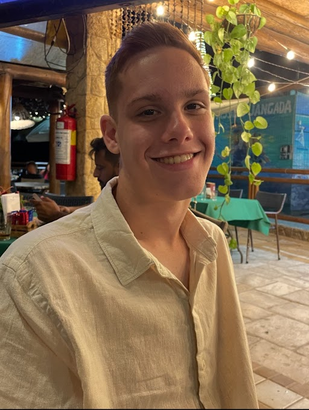
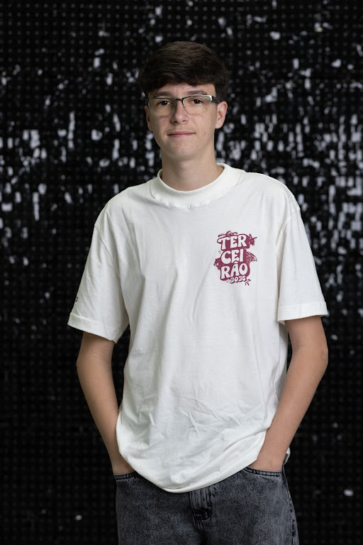
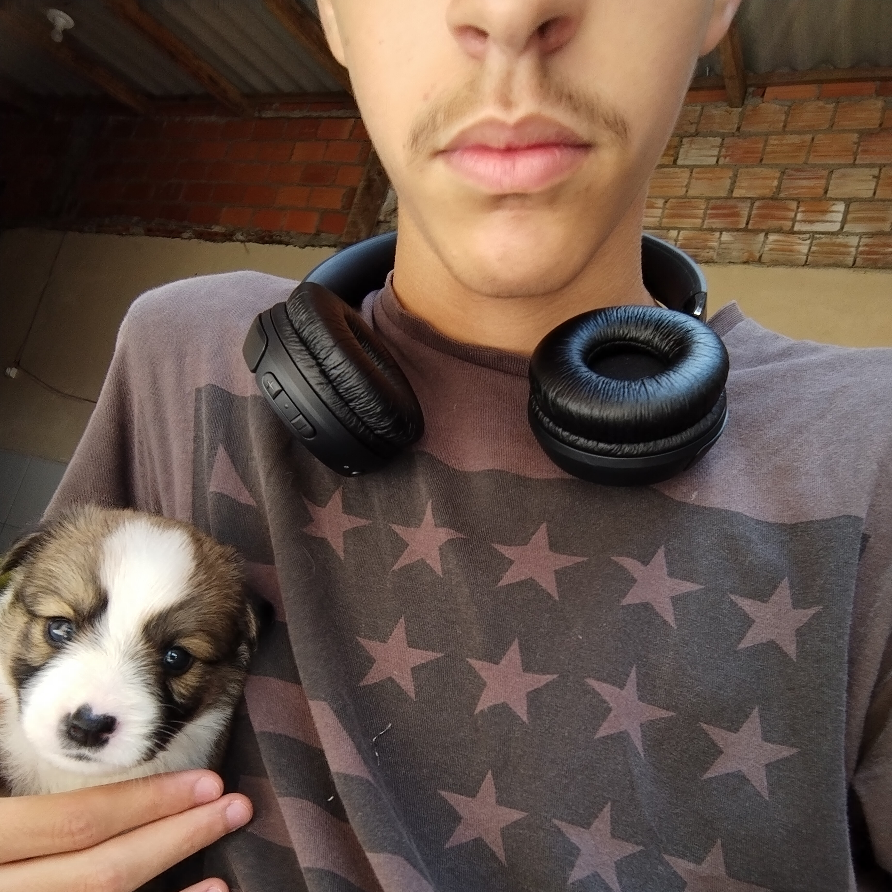
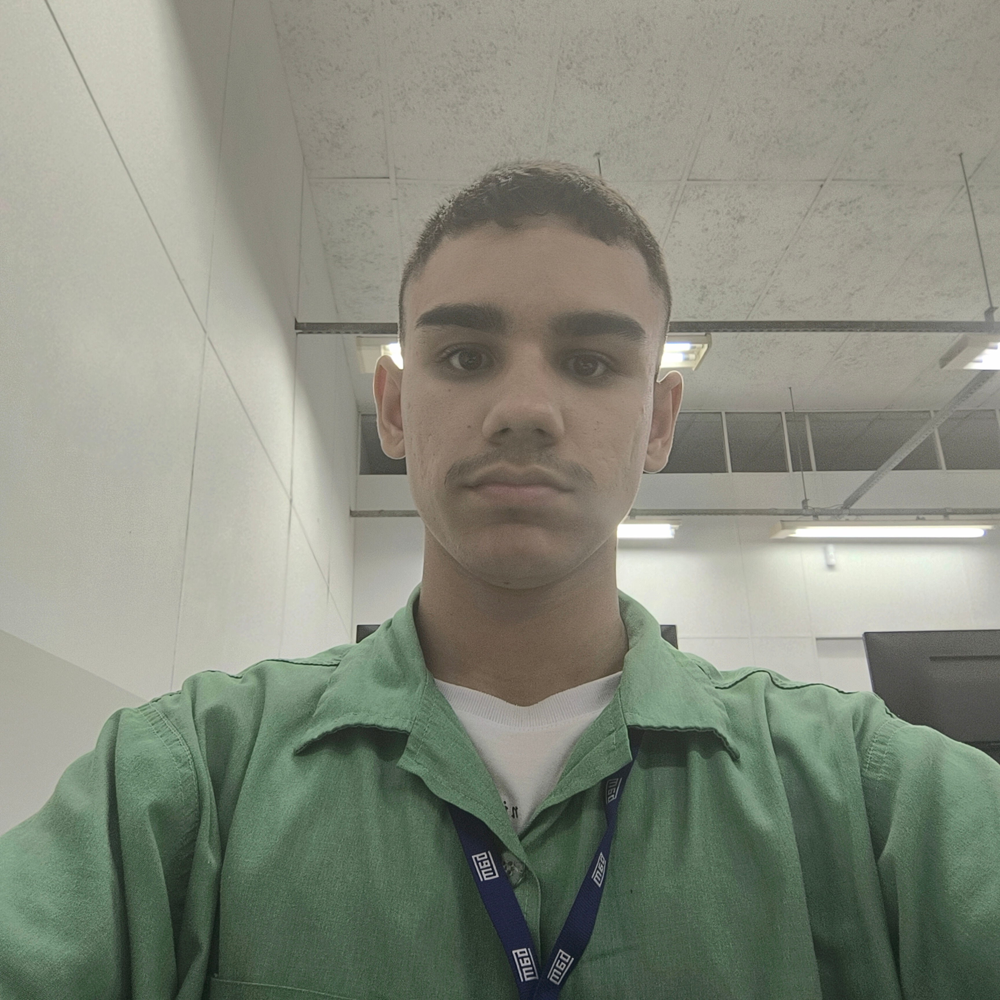

# WEG + Segura – MIDS 77🔒🌱

👩‍💻 Desenvolvido pela turma: Aprendizagem Industrial em Desenvolvimento de Sistemas - WEG - AI MIDS 77

# Objetivos 📝

O WEG + Segura – MIDS 77 é um sistema inteligente de monitoramento, contagem e evacuação de pessoas em salas da empresa, integrando Internet das Coisas (IoT), banco de dados na nuvem , back-end e front-end e automação de alertas para garantir segurança física, sustentabilidade e eficiência operacional.
O projeto permite controle em tempo real, emissão de relatórios automáticos e conformidade com a LGPD, atuando como suporte essencial para segurança corporativa e gestão de emergências.

 

# Funcionalidades 🔨

<table border="1" cellpadding="10" cellspacing="0">
    <tbody>
                <tr>
            <td>Controle de entrada/saída por RFID</td>
            <td>📥</td>
        </tr>
        <tr>
            <td>Leitura dupla (porta da sala + porta do corredor)</td>
            <td>🔎</td>
        </tr>
        <tr>
            <td>Atualização de presença em tempo real</td>
            <td>⚙️</td>
        </tr>
        <tr>
            <td>Atualização de presença em tempo real</td>
            <td>📤</td>
        </tr>
        <tr>
            <td>Registro de exceções (intervalos, troca de sala, crachá esquecido)</td>
            <td>📖</td>
        </tr>
        <tr>
            <td>Detecção de acessos indevidos e bloqueio automático</td>
            <td>📌</td>
        </tr>
        <tr>
            <td>Visualização da planta digital da empresa com status de cada salaa</td>
            <td>🗂️</td>
        </tr>
        <tr>
            <td>Relatórios automáticos e históricos de presença</td>
            <td>❎</td>
        </tr>
    </tbody>
</table>

 

# Tecnologias Utilizadas 👾

    
    
    
    
    
    
    
    
    
    
    

# Como foi Desenvolvido 🤔

# Conformidade com a LGPD 🔐

O sistema foi projetado para seguir integralmente a Lei Geral de Proteção de Dados, garantindo:

- Cadastro com consentimento informado

- Uso exclusivo para segurança e emergências

- Armazenamento seguro (SSL/TLS)

- Criptografia em trânsito e repouso

- Acesso restrito por nível de permissão

- Política de privacidade visível e aceita pelo usuário

- Exclusão de dados mediante solicitação
  
- Modo teste sem registro de dados reais

   

# Projeto Montado 🧑‍💻

# Como Acessar ❓

# Autores 👤

|  <a href="https://github.com/Liiiiisssz">Elis Jasper</a>  |  <a href="https://github.com/Viihh-77">Gabrielli Vitória Glowatski</a>  |  <a href="https://github.com/Ana18022008">Ana Beatriz O. Ribeiro</a>  |  <a href="https://github.com">Carlos Eduardo Braga</a>  |  <a href="https://github.com/Catarina0830">Catarina</a>  |  <a href="https://github.com/Murilo2901">Murilo</a>  |  <a href="https://github.com/lucasschlei">Lucas</a>  |  <a href="https://github.com/min07775">Iasmin</a>  |  <a href="https://github.com/Jose7764">José</a>  |  <a href="https://github.com/danielSismer">Daniel</a>  |  <a href="https://github.com/EduardoDias1902">Eduardo</a>  |  <a href="https://github.com/gabrielEFagundes">Gabriel</a>  |
| :---: | :---: | :---: | :---: |

 

