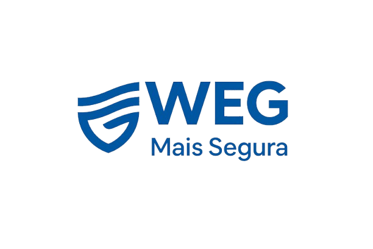
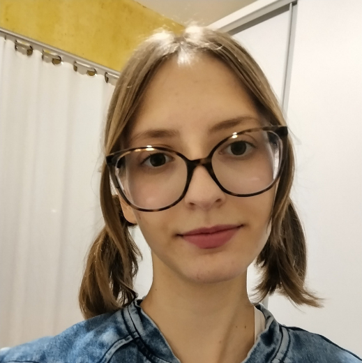
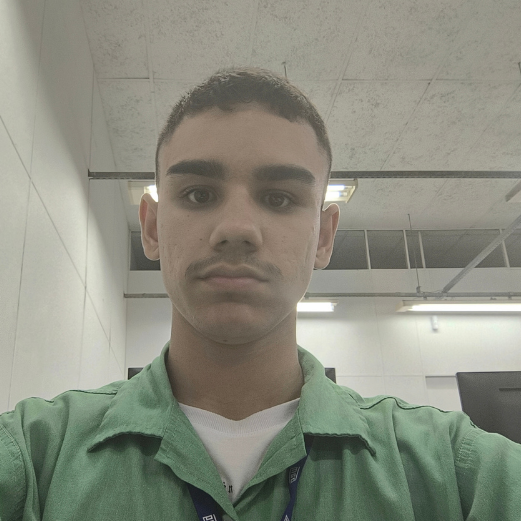
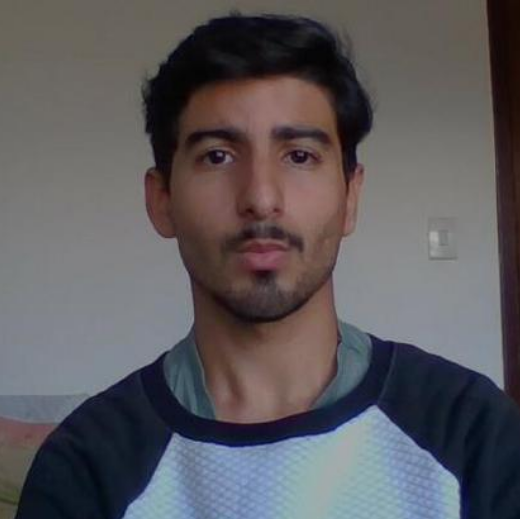
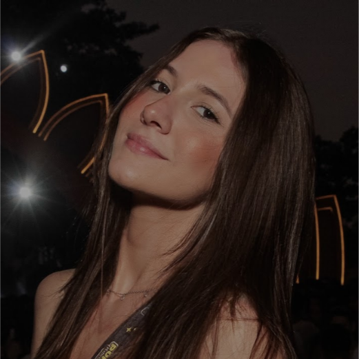
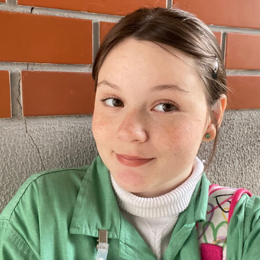
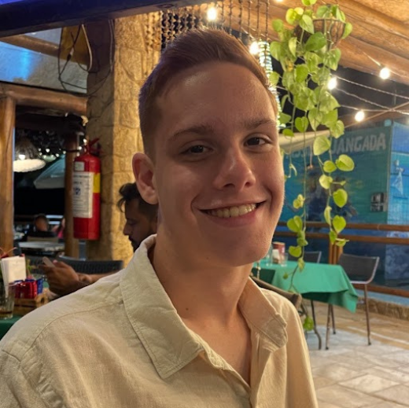

<p align="center">
  
</p>
<h1 align="center">
WEG + Segura – MIDS 77🔒🌱
</h1>
  
<p align="center">
👩‍💻 Desenvolvido pela turma: Aprendizagem Industrial em Desenvolvimento de Sistemas - WEG - AI MIDS 77
</p>

<p align="center">


# Objetivos 📝

O WEG + Segura – MIDS 77 é um sistema inteligente de monitoramento, contagem e evacuação de pessoas em salas da empresa, integrando Internet das Coisas (IoT), banco de dados na nuvem , back-end e front-end e automação de alertas para garantir segurança física, sustentabilidade e eficiência operacional.
O projeto permite controle em tempo real, emissão de relatórios automáticos e conformidade com a LGPD, atuando como suporte essencial para segurança corporativa e gestão de emergências.

<br>

# Funcionalidades 🔨


<table border="1" cellpadding="10" cellspacing="0">
    <tbody>
        <tr>
            <td>Controle de entrada/saída por RFID</td>
            <td>📥</td>
        </tr>
        <tr>
            <td>Leitura dupla (porta da sala + porta do corredor)</td>
            <td>🔎</td>
        </tr>
        <tr>
            <td>Atualização de presença em tempo real</td>
            <td>⚙️</td>
        </tr>
        <tr>
            <td>Atualização de presença em tempo real</td>
            <td>📤</td>
        </tr>
        <tr>
            <td>Registro de exceções (intervalos, troca de sala, crachá esquecido)</td>
            <td>📖</td>
        </tr>
        <tr>
            <td>Detecção de acessos indevidos e bloqueio automático</td>
            <td>📌</td>
        </tr>
        <tr>
            <td>Visualização da planta digital da empresa com status de cada salaa</td>
            <td>🗂️</td>
        </tr>
        <tr>
            <td>Relatórios automáticos e históricos de presença</td>
            <td>❎</td>
        </tr>
    </tbody>
</table>

<br>


# Tecnologias Utilizadas 👾

<div style="display: flex; flex-wrap: wrap; align-items: center; gap: 15px;">
    
    
    
    
    
    
    
    
    
    
    
    
    
    
</div>


# Como foi Desenvolvido 🤔

Para o desenvolvimento do projeto, a turma foi organizada em áreas de interesse, de acordo com o que cada integrante mais gostava de estudar e praticar. Dessa forma, todos puderam contribuir com suas habilidades:


Front-End 🎨: Responsáveis pela interface do usuário, cuidando do design, usabilidade e interação visual do sistema.


Back-End ⚙️: Cuidaram da lógica de funcionamento do sistema, das regras de negócio e da integração com os outros módulos.


Banco de Dados 💾: Garantiram a estruturação, armazenamento e segurança das informações, além de otimizar consultas e integrações.


IoT (Internet das Coisas) 📡: Trabalharam na comunicação entre dispositivos e sistemas inteligentes, garantindo conectividade e automação.


Eletrônica 🔌: Montaram e ajustaram os circuitos, sensores e componentes necessários para o funcionamento físico do projeto.


# Conformidade com a LGPD 🔐

O sistema foi projetado para seguir integralmente a Lei Geral de Proteção de Dados, garantindo:


- Cadastro com consentimento informado

- Uso exclusivo para segurança e emergências

- Armazenamento seguro (SSL/TLS)

- Criptografia em trânsito e repouso

- Acesso restrito por nível de permissão

- Política de privacidade visível e aceita pelo usuário

- Exclusão de dados mediante solicitação
  
- Modo teste sem registro de dados reais

  <br>


# Projeto Montado 🧑‍💻


# Como Acessar ❓

Para rodar o projeto na sua máquina, siga os passos abaixo: 

1️⃣ Clone este repositório:
```bash
git clone https://github.com/andrMiotto/WEG-Segura-Sustentavel.git
````
2️⃣ Entre na pasta do projeto (se necessário, crie uma nova):
```bash
cd WEG-Segura-Sustentavel/seguranca
````
3️⃣ Execute o projeto: <br> 

### Front-End: 
1️⃣ Abra a pasta do **front-end** no VS Code. <br>
2️⃣ Instale a extensão **Live Server** (se ainda não tiver). <br>
3️⃣ Clique com o botão direito no arquivo index.html e selecione **Go Live**. <br>
4️⃣ O navegador abrirá automaticamente mostrando a interface. <br>

### Back-End: 
1️⃣ Execute o projeto com Maven:
```bash
./mvnw spring-boot:run
````

👉 Caso já possua Maven instalado:
```bash
mvn spring-boot:run
````

2️⃣ Quando o servidor iniciar, aparecerá no terminal um link parecido com:
```bash
http://localhost:8080
````

➡️ Clique nesse link ou copie/cole no navegador para acessar.

# Autores 👤

<table style="border-spacing: 20px; border-collapse: separate; width: 100%;"> <tr> <td style="text-align: center; border: 2px solid #ccc; padding: 5px;"> <br> <sub><a href="https://github.com/Ana18022008">Ana Beatriz O. Ribeiro</a></sub> </td> <td style="text-align: center; border: 2px solid #ccc; padding: 5px;"> <br> <sub><a href="https://github.com/andrMiotto">André Luis Miotto Pereira</a></sub> </td> <td style="text-align: center; border: 2px solid #ccc; padding: 5px;"> <br> <sub><a href="https://github.com">Carlos Eduardo Braga</a></sub> </td> <td style="text-align: center; border: 2px solid #ccc; padding: 5px;"> <br> <sub><a href="https://github.com/Catarina0830">Catarina Klein</a></sub> </td> <td style="text-align: center; border: 2px solid #ccc; padding: 5px;"> <br> <sub><a href="https://github.com/danielSismer">Daniel Vinicius Rios Sismer</a></sub> </td> <td style="text-align: center; border: 2px solid #ccc; padding: 5px;"> <br> <sub><a href="https://github.com/EduardoDias1902">Eduardo Dias da Maia</a></sub> </td> </tr> <tr> <td style="text-align: center; border: 2px solid #ccc; padding: 5px;"> <br> <sub><a href="https://github.com/Liiiiisssz">Elis Jasper</a></sub> </td> <td style="text-align: center; border: 2px solid #ccc; padding: 5px;"> <br> <sub><a href="https://github.com/manu-hostin">Emanuelle Cristina Hostin</a></sub> </td> <td style="text-align: center; border: 2px solid #ccc; padding: 5px;"> <br> <sub><a href="https://github.com/gabrielEFagundes">Gabriel Ehrat Fagundes</a></sub> </td> <td style="text-align: center; border: 2px solid #ccc; padding: 5px;"> <br> <sub><a href="https://github.com/Viihh-77">Gabrielli Vitória Glowatski</a></sub> </td> <td style="text-align: center; border: 2px solid #ccc; padding: 5px;"> <br> <sub><a href="https://github.com/HugoDeleonP">Hugo Deleon Giminiani<br> de Souza Paim</a></sub> </td> <td style="text-align: center; border: 2px solid #ccc; padding: 5px;"> <br> <sub><a href="https://github.com/min07775">Iasmin Nunes</a></sub> </td> </tr> <tr> <td style="text-align: center; border: 2px solid #ccc; padding: 5px;"> <br> <sub><a href="https://github.com/Jose7764">José Azarías Pérez Torres</a></sub> </td> <td style="text-align: center; border: 2px solid #ccc; padding: 5px;"> <br> <sub><a href="https://github.com/KaelLuih">Kael Luih de Araujo</a></sub> </td> <td style="text-align: center; border: 2px solid #ccc; padding: 5px;"> <br> <sub><a href="https://github.com/kerolynpadilha">Kerolyn Messias Padilha</a></sub> </td> <td style="text-align: center; border: 2px solid #ccc; padding: 5px;"> <br> <sub><a href="https://github.com/leandroFilipy">Leandro Filipy de Lima</a></sub> </td> <td style="text-align: center; border: 2px solid #ccc; padding: 5px;"> <br> <sub><a href="https://github.com/lucasschlei">Lucas Schlei</a></sub> </td> <td style="text-align: center; border: 2px solid #ccc; padding: 5px;"> <br> <sub><a href="https://github.com/Dudazabel">Maria Eduarda Zabel</a></sub> </td> </tr> <tr> <td style="text-align: center; border: 2px solid #ccc; padding: 5px;"> <br> <sub><a href="https://github.com/Matheus089107">Matheus Alexandre<br> de Castro</a></sub> </td> <td style="text-align: center; border: 2px solid #ccc; padding: 5px;"> <br> <sub><a href="https://github.com/melll1601">Melissa Rafaela Pereira</a></sub> </td> <td style="text-align: center; border: 2px solid #ccc; padding: 5px;"> <br> <sub><a href="https://github.com/Murilo2901">Murilo Kerschbaum</a></sub> </td> </tr> </table>


 


